**Moohoo - Gute Nachricht, Freunde!**

Mit dem Nightly Branch ist es nun möglich, einen externen Identity Provider als weitere Authentifizierungsquelle zu nutzen. 
Dafür nutzt die mailcow das OIDC Protokoll, um ausschließlich Mailbox User zu authentifizieren. 
Um das zu ermöglichen, haben wir ein paar Änderungen an der Art und Weise vorgenommen, wie die Authentifizierung funktioniert.  

Lasst uns mal darüber sprechen, was sich geändert hat, was wir uns dabei gedacht haben und was wir in Zukunft noch hinzufügen möchten. Natürlich zeigen wir euch auch, wie ihr das neue Feature nutzen könnt. 
Um die Dinge zu vereinfachen, verwende ich im weiteren Beitrag die Abkürzung `IdP` für Identity Provider   

### Was wurde geändert und warum?
Unser Ziel war es, dass man neben der bestehenden SQL Datenbank, gleichzeitig einen IdP als Authentifizierungsquelle nutzen kann. 
Dabei kann immer **nur ein IdP** konfiguriert werden und nicht mehrere. 
Die mailcow muss jetzt also je nach User entscheiden können, welche Authentifizierungsquelle genutzt werden soll. 
Um das zu ermöglichen, haben wir Änderungen an den Diensten mailcow UI (phpfpm), Dovecot und SOGo vorgenommen. 

#### mailcow UI
Die gesamte Logik zur Authentifizierung haben wir auf den phpfpm-Dienst ausgelagert. 
Für jeden User wird nun eine Authentifizierungsquelle hinterlegt, die zurzeit entweder mailcow, Keycloak oder Generic-OIDC sein kann. 
Beim Login nutzt mailcow dann die entsprechende Quelle zur Authentifizierung. 

#### Dovecot
Dovecot hat bis jetzt ein custom LUA Script für die Authentifizierung genutzt, das SQL-Queries verwendet hat. 
Statt SQL-Queries, werden nun HTTP-Requests zu einem intern verfügbaren PHP-Script verwendet. 
User die sich über den IdP authentifizieren, **müssen App Passwörter erstellen**, damit weiterhin Mailclients wie Thunderbird genutzt werden können. 
Es gibt noch eine weitere Möglichkeit, damit nicht extra App Passwörter erstellt werden müssen. Die steht allerdings nur für den Keycloak Provider zur Verfügung.  Dazu komme ich aber später. 

#### SOGo
Viele haben sich vielleicht gefragt, warum der mailcow Login unter dem Root-Pfad angezeigt wird und nicht der SOGo Login. 
Für den SOGo Login existiert schon länger ein Proxy Auth Feature, welches aus der mailcow UI genutzt werden kann. 
Durch das Proxy Auth Feature können sich eingeloggte User zum SOGo weiterleiten lassen, ohne sich erneut anmelden zu müssen. 
Dadurch haben die User vorher noch die Möglichkeit, weitere Features zu nutzen, wie die Passwortänderung, App Passwörter, temporäre Aliase, usw. 
Damit das Feature mehr hervorgehoben wird, haben wir deswegen die mailcow UI überarbeitet und einen auffälligen blauen Button direkt oben platziert, den wirklich niemand übersehen sollte. 
User, die den IdP nutzen, können sich nur über die mailcow UI im SOGo einloggen. **Ein direktes Einloggen über SOGo funktioniert nicht.** 

#### App-Links
Da ein direkter Login über SOGo für IdP User nicht funktioniert, haben wir gleichzeitig die App-Links überarbeitet, damit es in Zukunft nicht zu Verwirrung führt. 
App-Links können jetzt in den Einstellungen für den Login entweder versteckt oder angezeigt werden. 
Die standardmäßige Verlinkung auf SOGo im mailcow Login wird versteckt. Eingeloggte User sehen jedoch weiterhin alle Apps. 
Desweiteren kann man für eingeloggte User einen extra Link eintragen, wobei man hier mit `%u` eine Placeholder für den Usernamen hat. 
Z.B. können eingeloggte User per App-Link so an das Proxy Auth Script mit `/sogo-auth.php?login=%u` weitergeleitet werden.  

    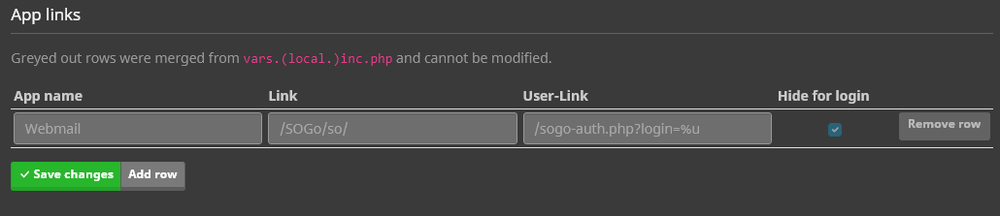

   

### Ideen für die Zukunft
Für die Zukunft könnten wir in Erwägung ziehen, dass ihr bei einzelnen Users einstellen könnt, wohin sie nach dem Login weitergeleitet werden sollen (mailcow oder SOGo).  
Außerdem haben wir durch die Überarbeitung der Authentifizierung die Login-Funktion in verschiedene Funktionen für Admins, Domain Admins, User und App-Passwort-Login aufgeteilt. 
Wir könnten darüber nachdenken, den Login für Admin, Domainadmin und User über verschiedene Pfade bereitzustellen. 
Dafür müssten wir dann aber auch die API in Admin-, Domainadmin- und User-API aufteilen.  
Auf der Grundlage dieses Features könnten wir auch weitere OIDC-Provider hinzufügen, falls der Generic-OIDC-Provider nicht ausreicht oder sogar doch direkt einen LDAP Provider hinzufügen. 
   

### Wie nutze ich dieses Feature?
Vorab möchte ich erwähnen, dass wir in unseren Tests bisher nur Keycloak als IdP getestet haben. Dennoch ist es möglich, auch andere IdP's (Generic-OIDC) einzurichten. Wenn ihr bereits einen anderen IdP wie zum Beispiel Authentik verwendet, würden wir uns über Feedback freuen.  

Die Voraussetzung für diese Anleitung ist, dass ihr bereits eine Keycloak-Instanz am Laufen habt.  

Für dieses Beispiel, nutzen wir folgendes Setup: 
- Keycloak als IdP
- Keycloak-Instanz ist unter https://mail.cow.tld/auth erreichbar
- mailcow-Instanz ist unter https://mail.cow.tld erreichbar
- Als Domain für unsere E-Mails verwenden wir `cow.tld`
- In Keycloak nutzen wir `mailcow` als Realm.

 

#### Keycloak Konfiguration
##### Schritt 1 
Installiert euch die mailcow Nightly Version auf einer Testinstanz. 
https://docs.mailcow.email/i_u_m/i_u_m_update/#best-practice-nightly-update
##### Schritt 2 
Logt euch als Admin in Keycloak ein und wechselt zu eurem Realm oder erstellt euch einen. 
In dem Realm erstellen wir nun einen neuen Client namens `mailcow` und konfigurieren Ihn wie folgt: 

    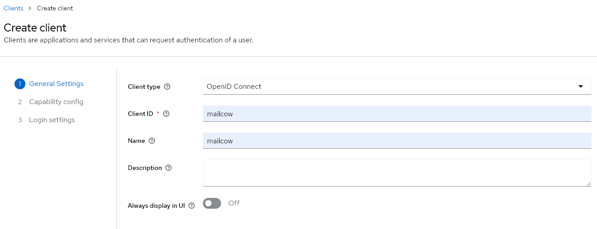
    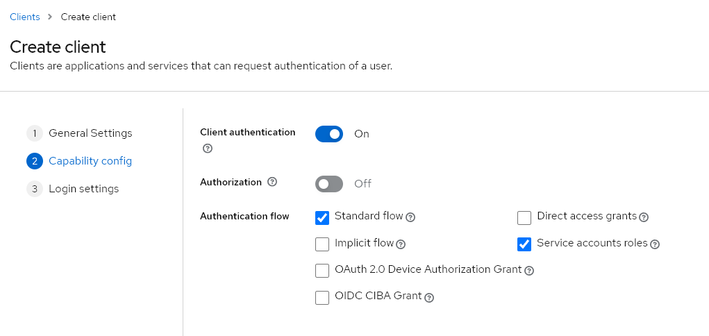
    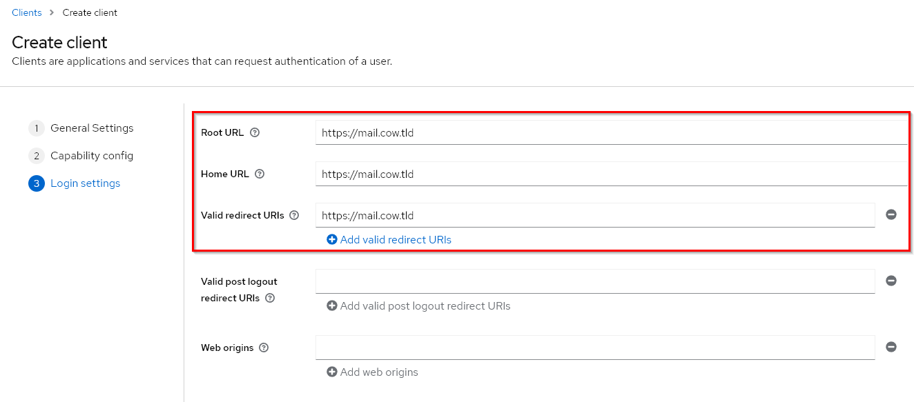

##### Schritt 3
Nach dem speichern des Clients, müssen wir für diesen noch ein User Attribute mit in den `token claim` aufnehmen. Das User Attribute nennt sich `mailcow_template` und durch folgende Einstellungen, wird dieses mit in den OIDC Endpoint `/userinfo` aufgenommen. Anhand dieses Attribute wird entschieden, wie die Mailbox konfiguriert wird (Quota, ACLs etc.)  

    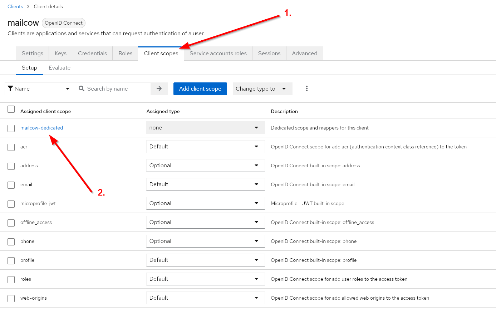
    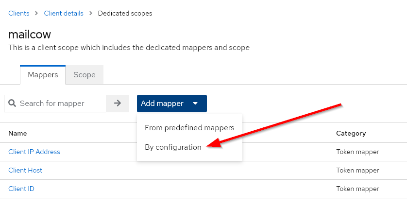
    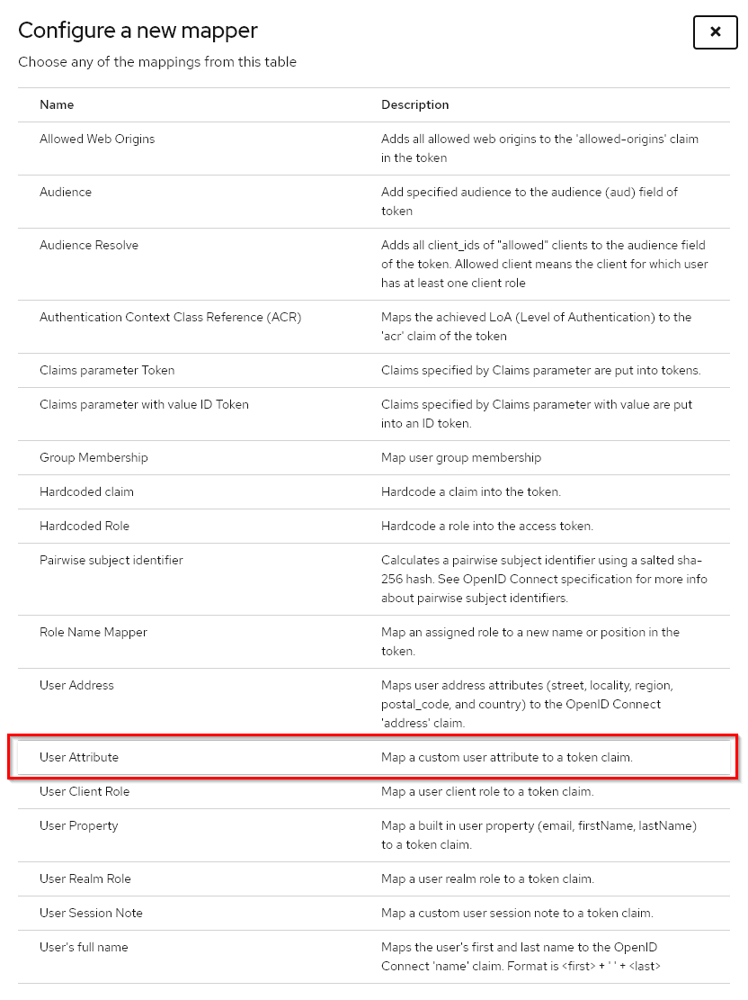
    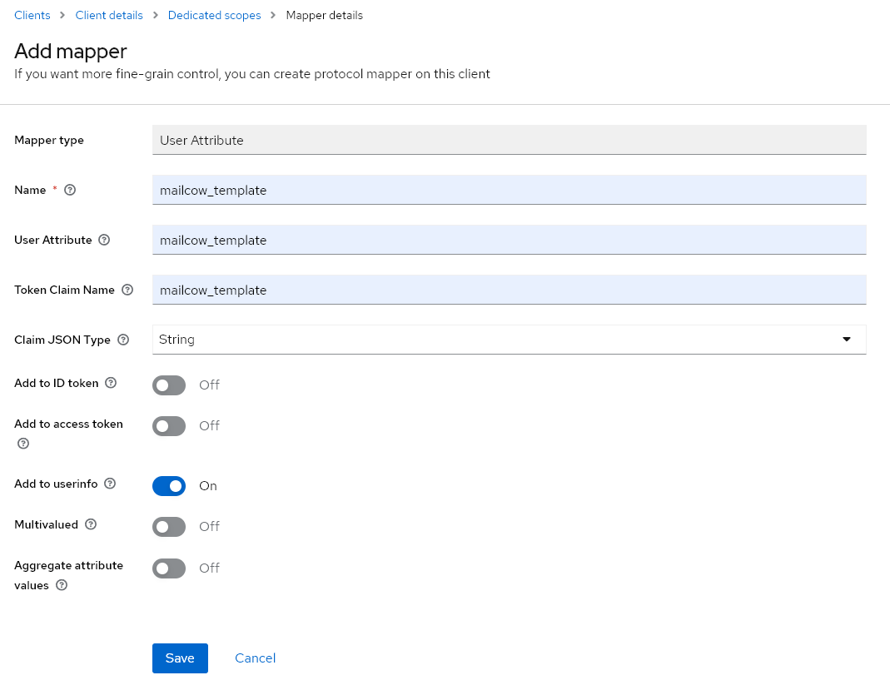

##### Schritt 4
Nun können wir unter der Client Konfiguration den Client Secret kopieren und mit der mailcow weitermachen. 

    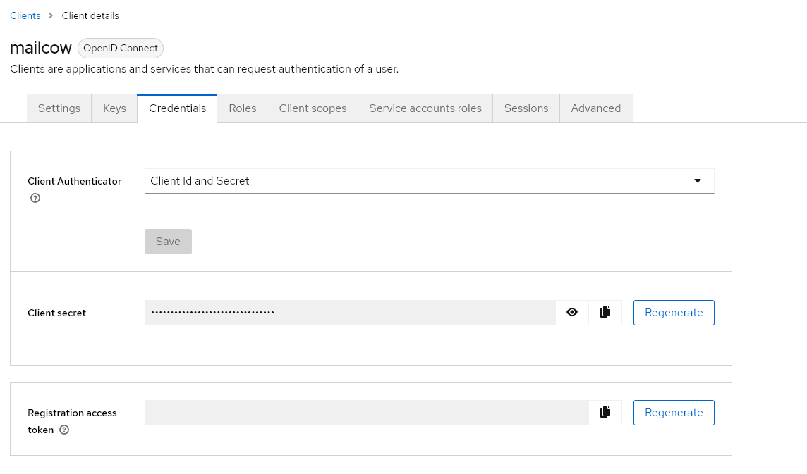

   

#### mailcow Konfiguration 
##### Schritt 1
Loggt euch in die mailcow ein und navigiert zu System -> Konfiguration -> Zugang -> Identity Provider. Füllt die Felder entsprechend aus. 
Die Keycloak Version steht im Admin Dashboard unter dem master Realm. Hier ist es eigentlich nur wichtig zu wissen, ob eine Version größer oder kleiner 20 benutzt wird, da mailcow dementsprechen den "openid" scope hinzugefügen muss. 
Das Attribute Mapping ist dafür da, dass mailcow anhand des Keycloak User Attributes `mailcow_template`, die entsprechend gemappte Mailbox Vorlage anwendet. 
Für das Beispiel habe ich keine extra Vorlage angelegt, weswegen wir ein Mapping auf die Default Vorlage einrichten. 
Alles ab dem Attribute Mapping können wir erstmal ignorieren. 

    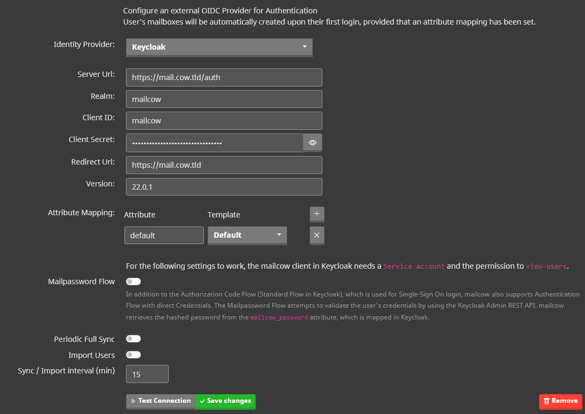

##### Schritt 2
Die Einstellungen können vor dem speichern getestet werden. Sollte der Test fehlschlagen, kontrolliert bitte, ob die mailcow die angegebene Server Url erreichen kann und die Angaben Realm, Client ID und Client Secret korrekt sind. 

    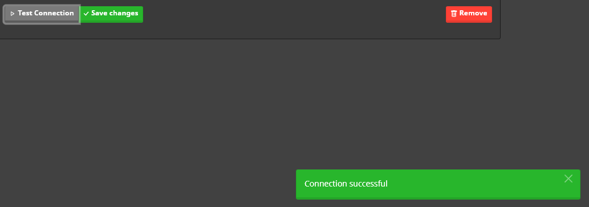

   

#### Test User anlegen
Wir können jetzt hingehen und einen User in Keycloak hinzufügen. Wechselt dafür wieder in das Keycloak Admin Dashboard und wählt euren Realm aus. 
Navigiert dann zu Users und fügt den neuen User hinzu. 

    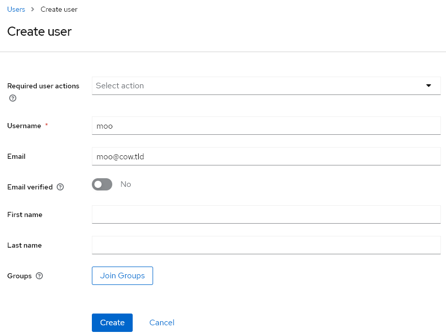

Danach geben wir noch an, dass der User eine `default mailbox` bekommt. 

    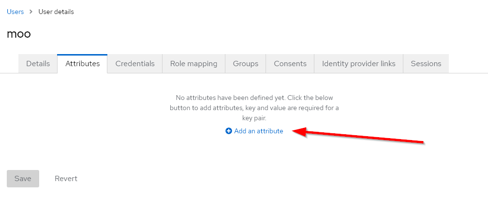
    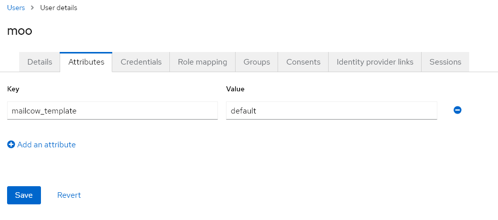

Zum Schluss natürlich noch dem neuen User unter dem `Credentials` Tab ein Passwort vergeben und fertig. 

Der neue User existiert mit unserer jetzigen Konfiguration nicht direkt in mailcow. Dies geschieht aber automatisch beim ersten Login. 
Navigiert zum mailcow Login und klickt auf den SSO Button im Dropdown. Dadurch werdet Ihr zu Keycloak weitergeleitet. 
Sollte der Keycloak Login funktionieren und ihr landet trotzdem wieder bei dem mailcow Login mit einer Fehlermeldung, vergewissert euch bitte, dass die Domain existiert und das Mailboxen unter dieser Domain erstellt werden können. 

    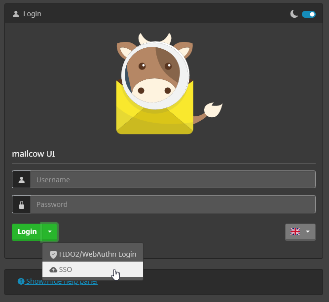

Hat alles funktioniert, seid ihr nun eingeloggt und landet bei der neuen User Seite. 
Ich denke den "Login to webmail" Button kann man schlecht übersehen. Außerdem fällt auf, dass hier keine Konfigurationsmöglichkeiten für Passwortänderung oder 2FA angezeigt werden, da diese über Keycloak konfiguriert werden. 

    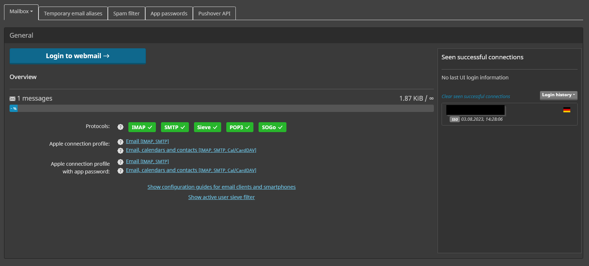

Wenn Ihr mit diesem User nun einen Mailclient wie Thunderbird benutzen wollt, könnt Ihr euch unter `App Passwords` entsprechend ein Passwort erstellen. 

   

#### IdP für existierende Mailbox User ändern
Ihr könnt den IdP für die bestehenden Mailbox User ganz einfach ändern. Ihr müsst nur sicherstellen, dass der User im IdP existiert, dann die Mailbox in mailcow bearbeiten und den gewünschten IdP auswählen. Wenn ihr später wieder zu mailcow als IdP zurückwechselt, wird das alte Passwort wiederverwendet.

    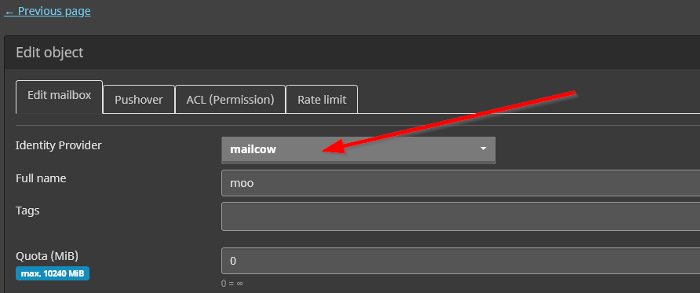

   

#### Automatische User Provisionierung

Keycloak als IdP kann in der mailcow auch so konfiguriert werden, dass in einem benutzerdefinierten Intervall Änderungen aller User kontrolliert werden. 
Damit können User automatisch angelegt werden und selbst bei nachträglichen Änderungen des `mailcow_template`, Attribute automatisch angepasst werden. 
Um das ganze konfigurieren zu können, benötigt der mailcow Client allerdings weitere Berechtigungen in Keycloak. Undzwar benötigt der Client die `view-users` Berechtigung. 
Damit können über die Keycloak Admin REST-API alle Realm User abgefragt werden. 

##### Schritt 1
Loggt euch als Admin in Keycloak ein, wechselt zu eurem Realm und bearbeitet den mailcow Client. 

    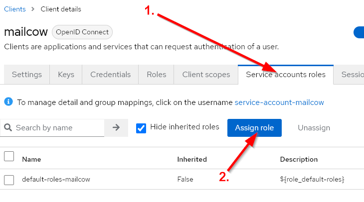
    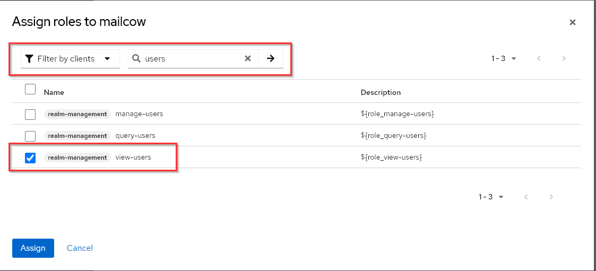

##### Schritt 2
Aktiviert in der mailcow UI unter Identity Provider `Periodic Full Sync` und `Import Users`. Wählt danach euren gewünschten Intervall in Minuten und speichert. 
`Periodic Full Sync` checkt, ob sich das `mailcow_template` Attribute geändert hat und passt die Mailbox dementsprechend an. 
`Import Users` checkt, ob neue User erstellt wurden und erstellt diese ebenfalls in mailcow. 

##### Schritt 3
Unter System -> Information -> Protokolle -> Crontasks landen alle Logs bzgl. der automatischen User Provisionierung. 
Sollte also irgendwas nicht passen, findet ihr dort mehr Infos.

##### Mailpassword Flow
Wie im Infotext unter der Option beschrieben, kann der Mailpassword Flow genutzt werden, um den User mittels des Keycloak Attribute `mailcow_password` zu authentifizieren. 
Dieses Passwort kann auch direkt für die mailcow UI, sowie Mailclients verwendet werden. 
Dafür muss der mailcow Client die `view-users` Berechtigung haben, wie unter ... beschrieben, und das Attribute `mailcow_password` muss in den `token claim` mit aufgenommen werden, wie unter ... beschrieben. 
Dem User kann in Keycloak nun das Attribute `mailcow_password` hinzugefügt werden. 
Das Passwort sollte gehashed werden und eines der folgenden Formate haben https://docs.mailcow.email/models/model-passwd/
Hier das Standard `moohoo` Passwort als Beispiel `{SSHA256}K8eVJ6YsZbQCfuJvSUbaQRLr0HPLz5rC9IAp0PAFl0tmNDBkMDc0NDAyOTAxN2Rk` 

   

#### LDAP
In Keycloak könnt ihr in eurem Realm unter `User Federation` ein LDAP Provider anbinden. 
https://www.keycloak.org/docs/latest/server_admin/#_ldap   
Nach dem konfigurieren muss noch das `mailcow_template` Attribute gemapped werden. Wenn gewünscht, kann mit der gleichen Prozedur auch das `mailcow_password` Attribute mappen. 
Mit der folgenden Konfiguration, mappen wir das LDAP Attribute `mailboxType` auf das Keycloak Attribute `mailcow_template`. Ist kein Wert vorhanden, forcieren wir `default` als Wert für `mailcow_template`.

    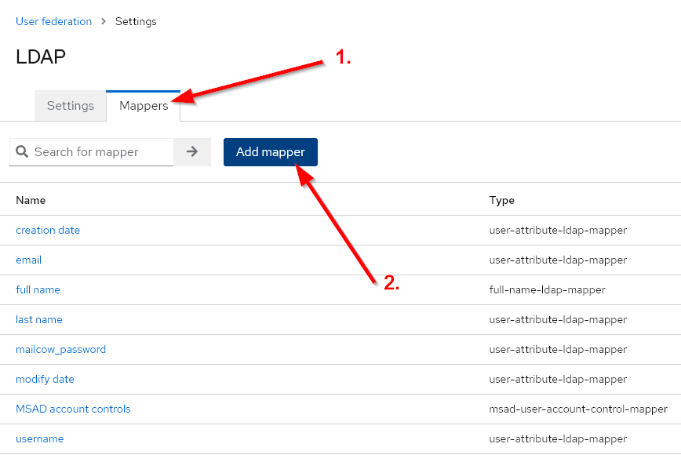
    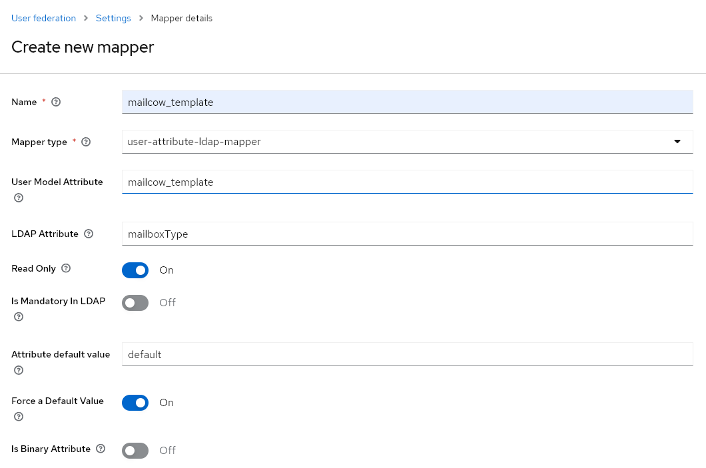

   

### Zum Schluss

**Die Authentifizierung wurde insgesamt stark verändert. Achtet beim Testen besonders auf Sicherheitslücken.** 
**Ansonsten können wir sagen: Viel Spaß beim Testen! Wir freuen uns auf euer Feedback und eure Bug Reports.** 
🐮 

 

---

Bleibt gesund und happy Mailing!

Euer mailcow Team
