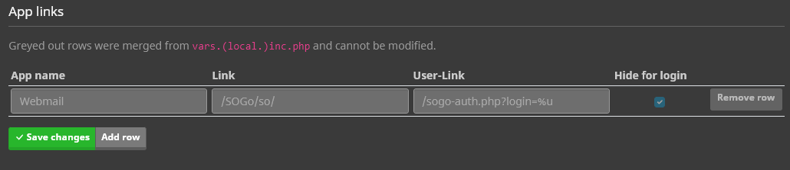
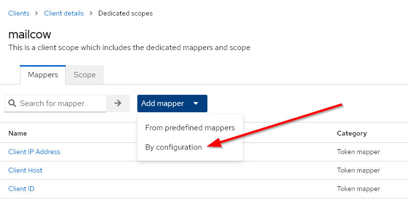
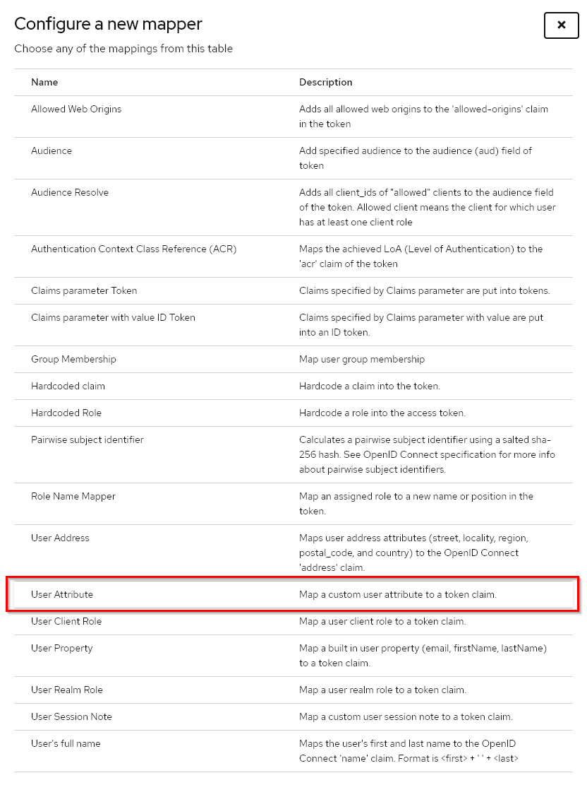
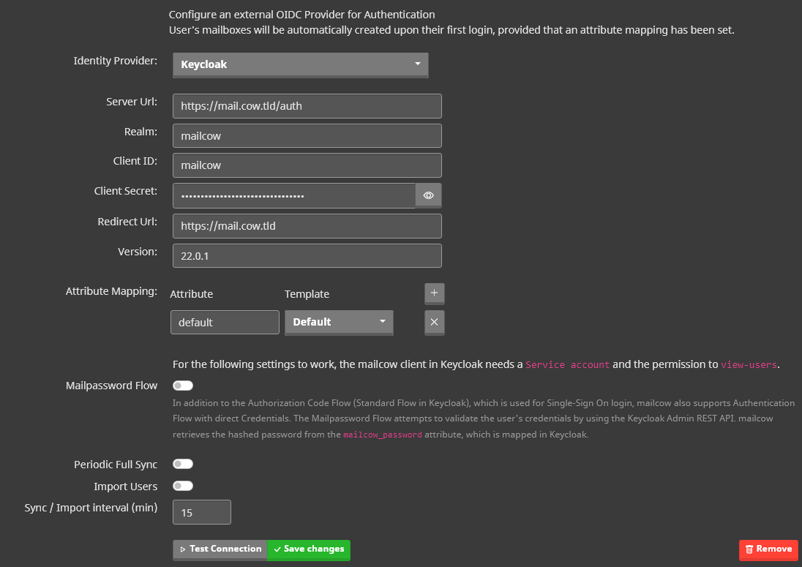
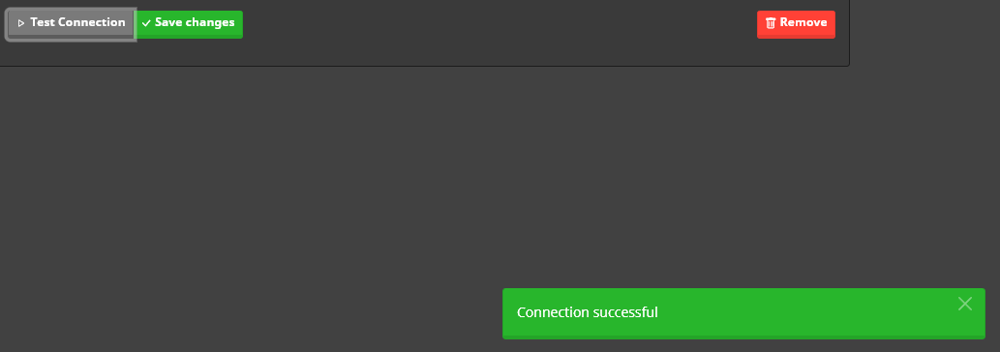
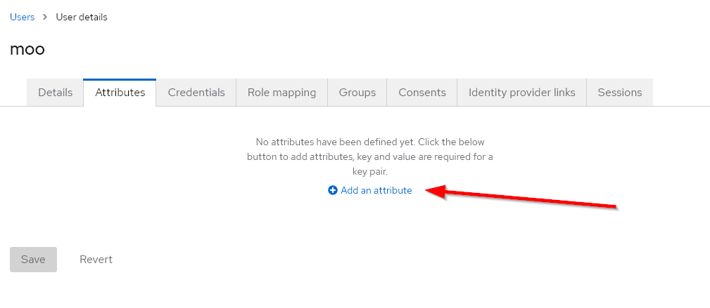
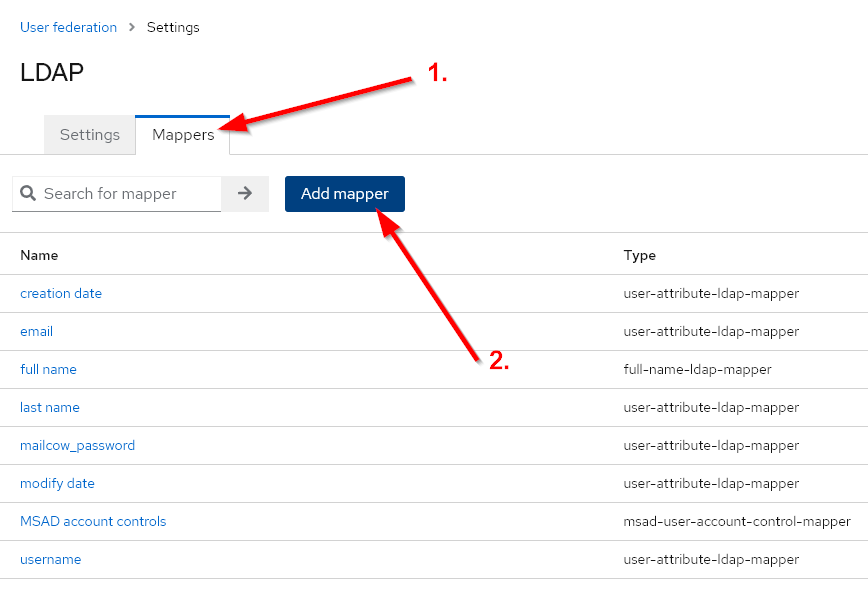
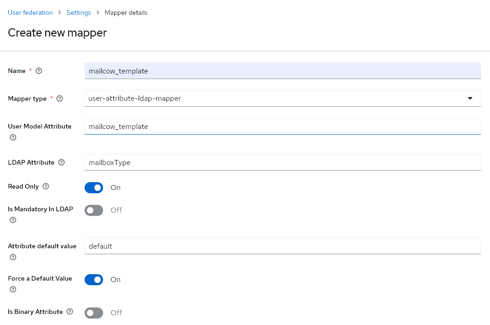

**Moohoo - Good News, everyone!**

With the Nightly Branch, it is now possible to use an external Identity Provider as an additional authentication source. 
mailcow utilizes the OIDC (OpenID Connect) protocol to authenticate only mailbox users. 
To enable this, we have made some changes to the way authentication works.  

Let's talk about what has changed, what we had in mind, and what we plan to add in the future. Of course, we will also show you how to use the new feature. 
To make things simpler, I'll use the term `IdP` (Identity Provider) throughout this post.   

### What has been changed and why?
Our goal was to enable the use of an IdP alongside the existing SQL database as an authentication source. However, **only one IdP** can be configured at a time, and multiple ones are not supported. 
Now, mailcow needs to be able to decide, depending on the user, which authentication source should be used. To make this possible, we have made changes to the services mailcow UI (phpfpm), Dovecot, and SOGo.

#### mailcow UI
We have outsourced the entire authentication logic to the phpfpm service. For each user, an authentication source is now defined, which can currently be either mailcow, Keycloak, or Generic-OIDC. During login, mailcow then uses the corresponding source for authentication.

#### Dovecot
Until now, Dovecot has been using a custom LUA script for authentication, which used SQL queries. Instead of SQL queries, HTTP requests to an internally available PHP script are now used. 
Users who authenticate via the IdP **must create App passwords** to continue using mail clients like Thunderbird. 
There is another option available to avoid creating additional App passwords, but this is only applicable for the Keycloak provider.  I'll explain that later.

#### SOGo
Many might have wondered why the mailcow login is displayed under the root path instead of the SOGo login.
For the SOGo login, there has been a Proxy Auth feature available for quite some time, which can be used from the mailcow UI.
With the Proxy Auth feature, logged-in users can be redirected to SOGo without needing to log in again. This allows users to access additional features beforehand, such as password change, app passwords, temporary aliases, etc.
To highlight this feature more prominently, we have redesigned the mailcow UI and placed a noticeable blue button at the top that nobody should overlook.
Users who use the IdP can only log in to SOGo through the mailcow UI. **Directly logging in through SOGo will not work.**

#### App Links
As direct login through SOGo does not work for IdP users, we have extended the app links to avoid confusion in the future.
App links can now be either hidden or displayed for the login. The default linking to SOGo in the mailcow login is hidden. However, logged-in users will still see all the apps.
Furthermore, an additional link can be entered for logged-in users, using `%u` as a placeholder for the username. For example, logged-in users can be redirected to the Proxy Auth script with `/sogo-auth.php?login=%u` using an app link.  

    

   

### Ideas for the future
In the future, we may consider allowing you to customize the post-login redirection for individual users, giving you the flexibility to choose whether they should be directed to mailcow or SOGo after logging in. 
Additionally, as a result of the authentication overhaul, we have now separated the login functions for Admins, Domain Admins, Users, and App Passwords. One potential idea is to offer different login paths for Admins, Domain Admins, and Users, which would also involve dividing the API into distinct Admin, Domain Admin, and User APIs. 
Building on this foundation, we could explore the possibility of adding more OIDC providers if the Generic-OIDC option proves insufficient. Alternatively, we might even consider directly integrating an LDAP provider.
Please note that these are just some potential ideas for future development.
   

### How do I use this feature?
Firstly, I want to mention that in our tests, we have only tested Keycloak as an IdP. However, it is also possible to set up other IdPs (Generic-OIDC). If you are already using a different IdP, such as Authentik, we would appreciate your feedback.   
The prerequisite for this guide is that you already have a running Keycloak instance. 

For this example, we will use the following setup:
- Keycloak as the IdP
- Keycloak instance accessible at https://mail.cow.tld/auth
- mailcow instance accessible at https://mail.cow.tld
- We use `cow.tld` as the domain for our emails
- In Keycloak, we use `mailcow` as the Realm.

 

#### Keycloak Configuration
##### Step 1
Install the mailcow Nightly version on a test instance. 
https://docs.mailcow.email/i_u_m/i_u_m_update/#best-practice-nightly-update
##### Step 2
Log in as an Admin to Keycloak and navigate to your Realm or create one. 
In the Realm, we will now create a new client named `mailcow` and configure it as follows:

    
    
    

##### Step 3
After saving the client, we need to include a User Attribute in the `token claim`. The User Attribute is named `mailcow_template`, and with the following settings, it will be included in the OIDC Endpoint `/userinfo`. Based on this attribute, the mailbox configuration will be determined (quota, ACLs, etc.).

    
    
    
    

##### Step 4
Now we can copy the Client Secret from the Client Configuration and proceed with mailcow.

    

   

#### mailcow Configuration
##### Step 1
Log in to mailcow and navigate to System -> Configuration -> Access -> Identity Provider. Fill in the fields accordingly. 
The Keycloak version can be found in the Admin Dashboard under the master Realm. It is essential to know whether a version greater or smaller than 20 is used since mailcow needs to add the "openid" scope accordingly. 
The Attribute Mapping is used by mailcow to apply the mapped mailbox template based on the Keycloak User Attribute `mailcow_template`. 
For this example, I haven't created an extra template, so we will set up a mapping to the Default template. 
We can ignore everything beyond the Attribute Mapping for now. 

    

##### Step 2
The settings can be tested before saving. If the test fails, please check whether mailcow can reach the specified server URL and verify that the Realm, Client ID, and Client Secret information are correct.

    

   

#### Create Test User
Now, let's proceed to add a user in Keycloak. Go back to the Keycloak Admin Dashboard and select your Realm.
Then, navigate to Users and add the new user.

    

Afterwards, let's specify that the user should receive a `default mailbox`.

    
    

Finally, don't forget to set a password for the new user under the `Credentials` tab, and you're done. 

With our current configuration, the new user does not exist directly in mailcow. However, this will happen automatically during the first login. 
Go to the mailcow login and click on the SSO button in the dropdown. This will redirect you to Keycloak. 
If the Keycloak login works, but you end up back at the mailcow login with an error message, please make sure that the domain exists and that mailboxes can be created under that domain.

    

Everything should work now, and you should be logged in, landing on the new user page. I believe you can't miss the "Login to webmail" button. Additionally, you'll notice that there are no configuration options for password change or 2FA displayed here since these are configured through Keycloak. 

    

If you want to use a mail client like Thunderbird with this user, you can create an app password under App Passwords accordingly.

   

#### Change IdP for existing mailbox users
The IdP for existing mailbox users can be changed. Make sure the user exists in the IdP and simply edit the mailbox in mailcow and select the IdP you want.
If you switch back to mailcow as IdP, it will reuse the old password.

    

   

#### Automatic User Provisioning

Keycloak, as an IdP, can be configured in mailcow to control changes for all users at a custom interval. This allows users to be automatically created, and even when the `mailcow_template` is modified later, attributes will be adjusted automatically. To configure this, the mailcow client needs additional permissions in Keycloak. Specifically, the client requires the `view-users` permission. With this permission, all Realm users can be queried through the Keycloak Admin REST API.

##### Step 1
Log in as an Admin to Keycloak, go to your Realm, and edit the mailcow client.

    
    

##### Step 2
In the mailcow UI, under Identity Provider, enable `Periodic Full Sync` and `Import Users`. Then, select your desired interval in minutes and save.
`Periodic Full Sync` checks if the `mailcow_template` attribute has changed and adjusts the mailbox accordingly.
`Import Users` checks if new users have been created and also creates them in mailcow.

##### Step 3
Under System -> Information -> Logs -> Crontasks, you will find all logs related to automatic user provisioning. If something doesn't work as expected, you can find more information there.

##### Mailpassword Flow
As described in the info text below the option, the Mailpassword Flow can be used to authenticate the user using the Keycloak attribute `mailcow_password`. This password can also be used directly for the mailcow UI and mail clients.  
For this to work, the mailcow client must have the `view-users` permission, as described above, and the attribute `mailcow_password` must be included in the `token claim`, as described above.
You can now add the attribute `mailcow_password` to the user in Keycloak.
The password should be hashed and have one of the following formats: https://docs.mailcow.email/models/model-passwd/
Here is an example of the standard `moohoo` password: `{SSHA256}K8eVJ6YsZbQCfuJvSUbaQRLr0HPLz5rC9IAp0PAFl0tmNDBkMDc0NDAyOTAxN2Rk` 

   

#### LDAP
In Keycloak, you can connect an LDAP provider in your Realm under `User Federation`. 
https://www.keycloak.org/docs/latest/server_admin/#_ldap   
After configuring, the `mailcow_template` attribute needs to be mapped. If desired, you can also map the `mailcow_password` attribute using the same procedure.
With the following configuration, we map the LDAP attribute `mailboxType` to the Keycloak attribute `mailcow_template`. If no value for `mailcow_template` is present, we force it to be `default`.

    
    

   

### In conclusion

**The authentication has undergone significant changes. When testing, pay special attention to security vulnerabilities.** 
**Otherwise, we can say: Enjoy testing! We look forward to your feedback and bug reports.** 
🐮 

 

---

Stay healthy and happy mailing!

Your mailcow Team
